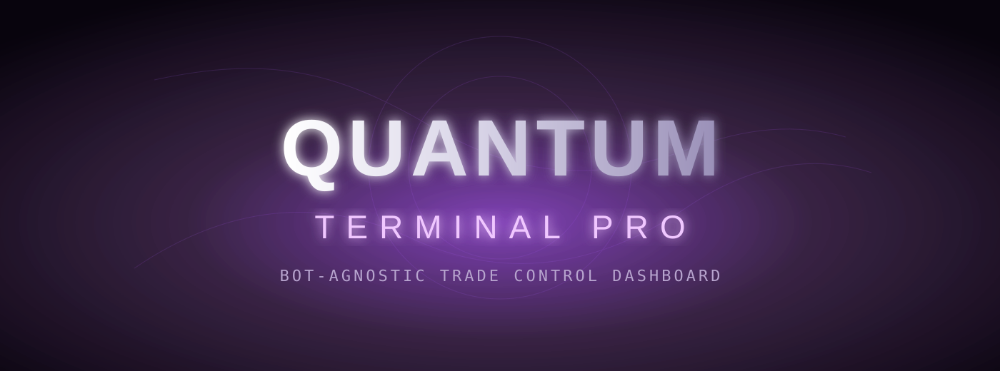
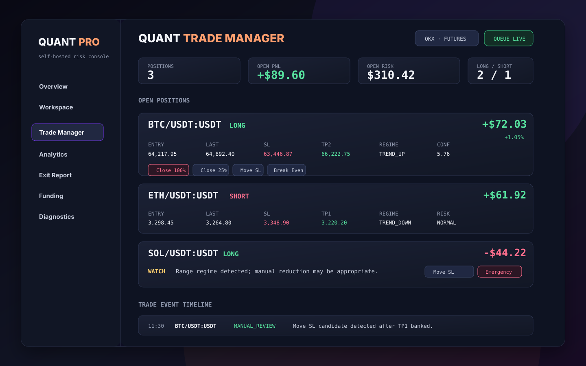
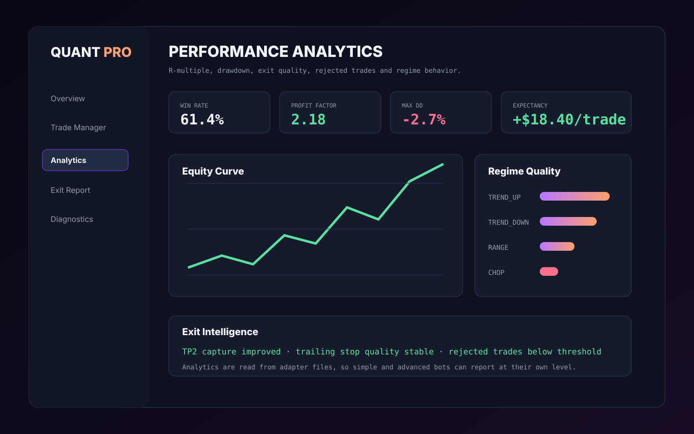
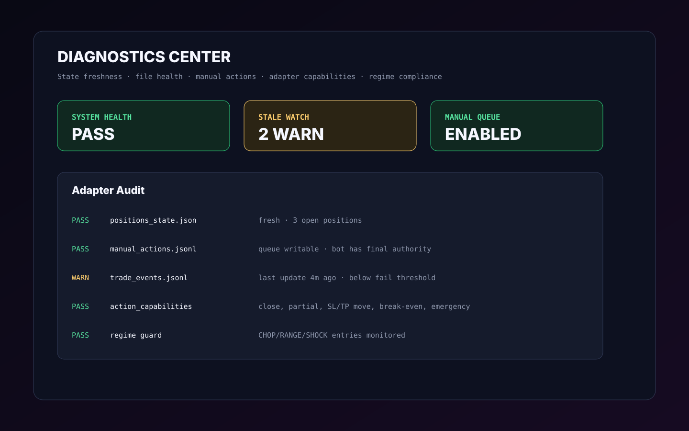
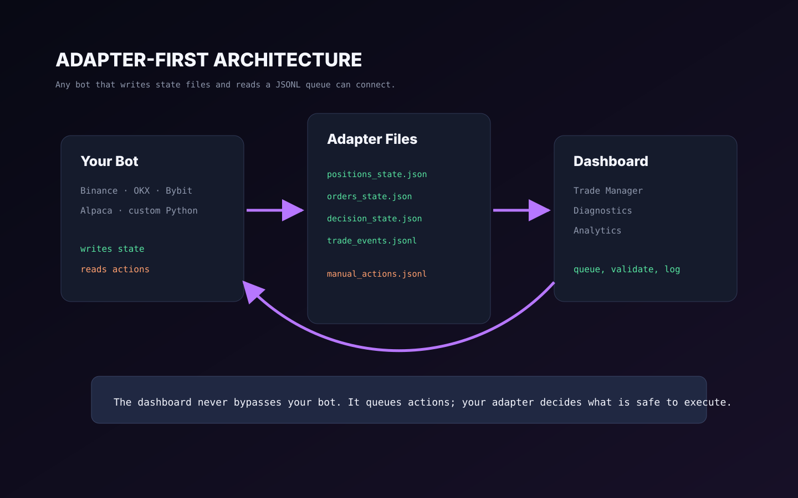
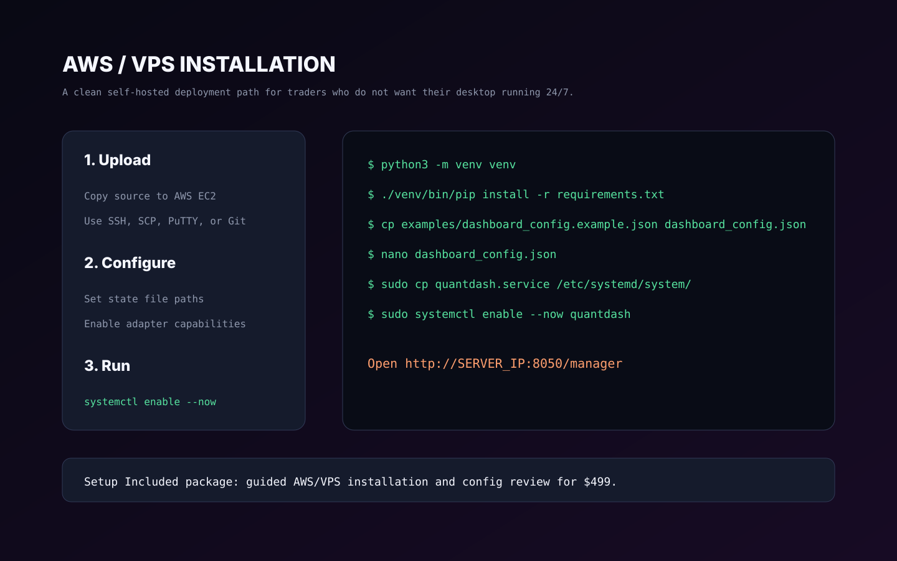
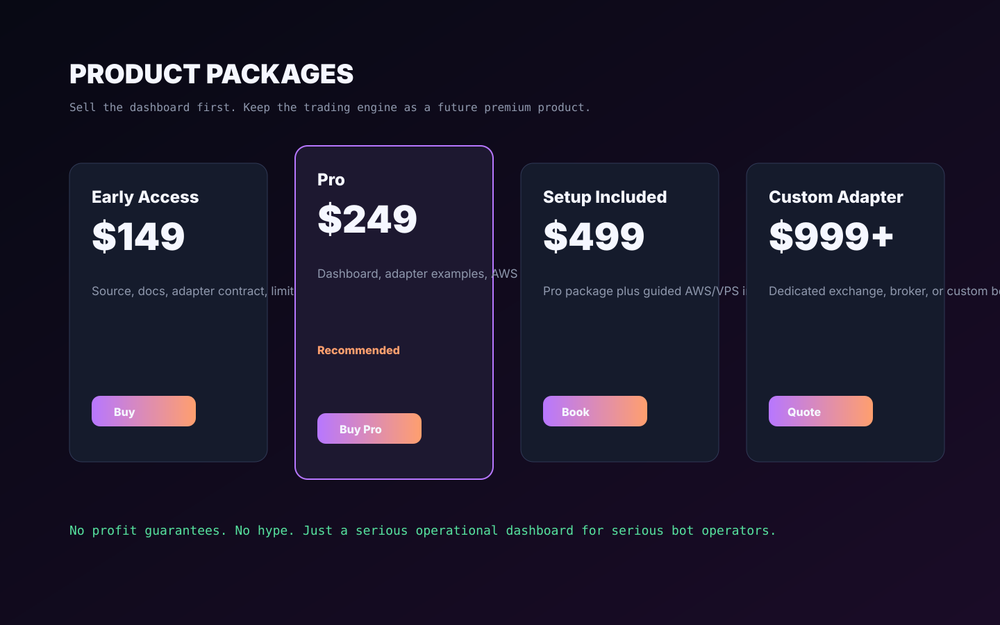

# Quantum Terminal Pro Dashboard



**Quantum Terminal Pro Dashboard** is a self-hosted trading bot control panel for
teams and solo traders who already run algorithmic trading systems and need a
clean way to monitor positions, inspect risk, review trade history, and queue
manual intervention commands.

It is designed as an adapter-first dashboard: your bot can be simple or complex.
If it can write state files and read a JSONL command queue, it can connect.

## Product Screenshots













## Why It Exists

Most bot dashboards are tied to one framework. Quantum Terminal Pro is built as a
neutral control layer for Binance, OKX, Bybit, Alpaca, and custom bots.

Inspired by the best expectations in modern bot tooling:

- Freqtrade/FreqUI style bot monitoring, web control, backtesting, and trade
  visibility.
- Hummingbot style multi-instance management, portfolio visibility, and strategy
  operations.
- OpenAlgo style broker/plugin architecture, analytics, PnL tracking, latency
  awareness, notifications, and self-hosted control.

Quantum Terminal Pro focuses on the missing middle: a premium operational
dashboard that can be attached to independent trading bots without rewriting the
bot itself.

## Core Features

- Multi-market dashboard: OKX, Binance, Bybit, Alpaca, and custom adapters.
- Live Trade Manager with position cards, open risk, open PnL, orders, and event
  timeline.
- Manual action queue for close, partial close, move SL, move TP, break even,
  and emergency close.
- Adapter capability flags so simple bots can expose only the actions they
  actually support.
- Analytics pages for R-multiple performance, win rate, profit factor, drawdown,
  opportunity loss, rejected trades, exit quality, and regime behavior.
- Diagnostics page for stale files, missing sources, regime violations,
  counter-trend conflicts, and data-quality coverage.
- Funding report for perpetual futures workflows.
- Responsive dark terminal UI.
- Self-hosted deployment with systemd and gunicorn.

## Adapter Model

The dashboard does not need direct access to your bot internals.

Your bot writes:

- `positions_state.json`
- `orders_state.json`
- `decision_state.json`
- `trade_events.jsonl`
- optional analytics JSONL files

The dashboard writes:

- `manual_actions.jsonl`

Your bot reads `manual_actions.jsonl`, validates the command, executes it using
its own exchange client, and writes a processed record.

See [Adapter Contract](docs/ADAPTERS.md) for the exact schema and examples.

## Supported Integrations

| Market | Live Candles | State Adapter | Manual Queue | Notes |
| --- | --- | --- | --- | --- |
| OKX | Yes, via ccxt | Yes | Yes | Perpetual futures |
| Binance | Yes, via ccxt | Yes | Yes | USDT futures example included |
| Bybit | Yes, via ccxt | Yes | Yes | USDT perpetual example included |
| Alpaca | Yes, via alpaca-py | Yes | Yes | US equities |
| Custom Bot | Optional | Yes | Yes | File-based adapter contract |

## Quick Start

```bash
cd /home/ubuntu/quant/dashboard
python3 -m venv venv
./venv/bin/pip install -r requirements.txt
cp examples/dashboard_config.example.json dashboard_config.json
nano dashboard_config.json
./venv/bin/python app.py
```

Open:

```text
http://SERVER_IP:8050/manager
```

Production deployment:

```bash
sudo cp quantdash.service /etc/systemd/system/quantdash.service
sudo systemctl daemon-reload
sudo systemctl enable --now quantdash
```

Full setup guide: [Installation](docs/INSTALL.md).

## Safety Model

Manual actions are queued, not executed directly by the dashboard. This gives
the bot adapter the final authority to:

- reject invalid symbols,
- enforce exchange-specific rules,
- respect paper/live mode,
- check current position state,
- log processed commands,
- protect unsupported actions.

Do not expose this dashboard publicly without authentication. Use SSH tunnel,
VPN, or nginx with HTTPS and access control. See [Security](SECURITY.md).

## Product Positioning

Quantum Terminal Pro Dashboard is not sold as a profitable trading bot. It is a
professional control surface for trading systems.

Best customer fit:

- traders running bots on AWS/VPS,
- developers with custom Python bots,
- quant hobbyists who need operational visibility,
- small trading teams that need a lightweight risk console.

Suggested commercial packaging:

- Early Access: dashboard source, docs, and adapter contract for $149.
- Pro: dashboard, adapter examples, AWS deployment guide, and updates for $249.
- Setup Included: Pro plus guided VPS/AWS installation for $499.
- Custom Adapter: exchange, broker, or bot-specific integration from $999.

More positioning notes: [Selling Guide](docs/SELLING.md).

## Disclaimer

This software is a trading operations dashboard. It does not guarantee profit and
does not provide financial advice. Trading involves substantial risk. Use paper
trading first and connect live execution only after reviewing your bot adapter.
